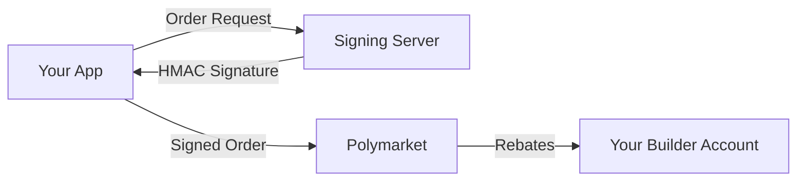

## What is Order Attribution?

Order attribution is a feature of the [Polymarket Builder Program](https://docs.polymarket.com/#builder-program) that allows developers to earn rebates on trading volume generated through their applications. When users place orders through your application, those orders can be attributed to your builder account, earning you a percentage of the trading fees.

## How It Works

The signing server acts as a secure intermediary that:

1. **Receives order requests** from your application
2. **Signs the orders** with your builder credentials using HMAC-SHA256
3. **Returns the signature** to your application
4. **Attributes orders** to your builder account when submitted to Polymarket

## Why Use a Signing Server?

### Security

Your builder API credentials (key, secret, passphrase) remain on your server and are never exposed in client-side code. This is critical for:

- **Preventing credential theft**: Credentials can't be extracted from your frontend
- **Maintaining control**: You control who can submit attributed orders

### Earning Rebates

The Builder Program offers:

- **Volume-based rebates**: Earn a percentage of trading fees on orders attributed to you
- **Passive income**: Earn from users trading on your platform
- **Scalable revenue**: More trading volume = more rebates

### Performance

The signing server is built with Bun for:

- **High throughput**: Handle thousands of signing requests per second
- **Low latency**: milliseconds response times
- **Efficient resource usage**: Minimal CPU and memory footprint

## Polys vs Official Server

The Polys signing server is a modern alternative to Polymarket's [official builder-signing-server](https://github.com/Polymarket/builder-signing-server):

| Feature | Polys Server | Official Server |
|---------|-------------|-----------------|
| Runtime | Bun | Node.js |
| Type Safety | Built-in (Valibot) | Manual validation |
| Hot Reload | Yes | No |
| Single-file Build | Yes | No |
| Performance | Higher | Standard |

## Key Features

- **Order Attribution**: Sign orders for Polymarket Builder Program rebates
- **High Performance**: Built with Bun's native HTTP server
- **Secure**: Bearer token authentication keeps builder credentials server-side
- **Type-Safe**: Configuration validation with Valibot
- **Lightweight**: Only 3 dependencies
- **Developer-Friendly**: Hot module reloading in development
- **Single-file Executable**: Compile to a portable binary with zero dependencies

## Getting Started

Ready to set up order attribution? Follow these guides:

1. **[Setup](/order-attribution/setup)** - Install and configure the signing server
2. **[Deployment](/order-attribution/deployment)** - Deploy to production
3. **[Client Usage](/order-attribution/client-usage)** - Integrate with your application
4. **[Troubleshooting](/order-attribution/troubleshooting)** - Solve common issues

## Learn More

- [Polymarket Builder Program Documentation](https://docs.polymarket.com/#builder-program)
- [Official Builder Signing Server](https://github.com/Polymarket/builder-signing-server)
- [Getting Started](/guides/getting-started)
